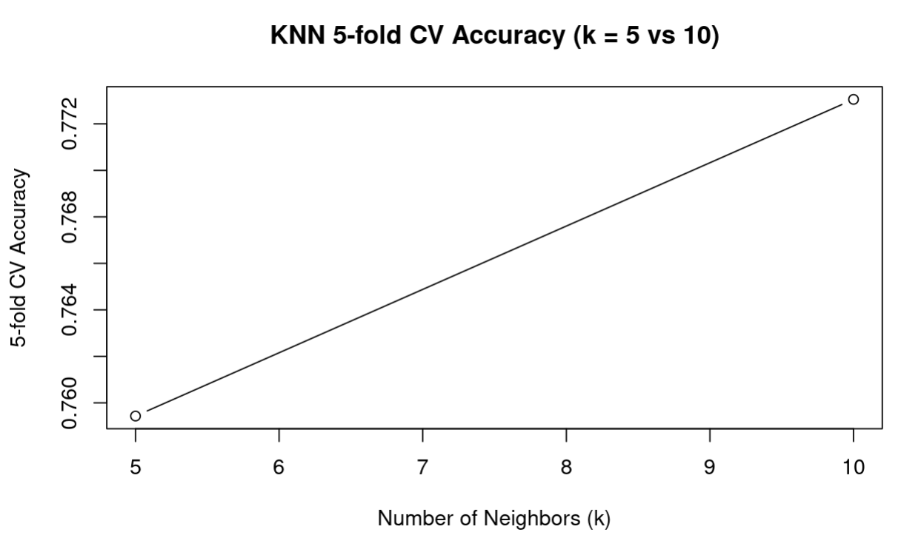
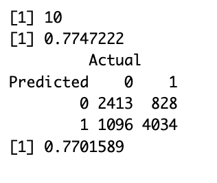
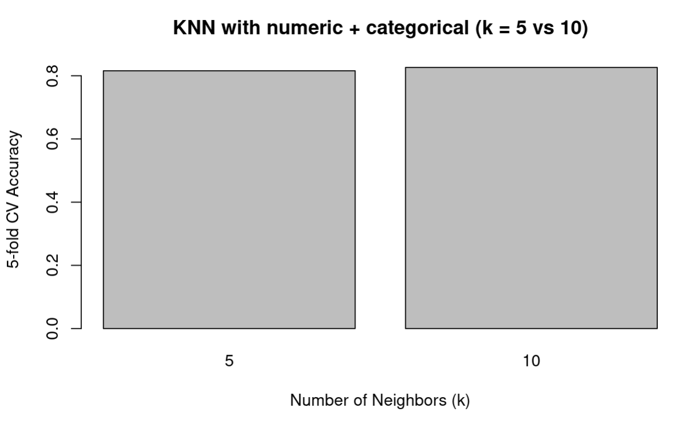
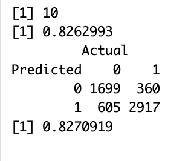
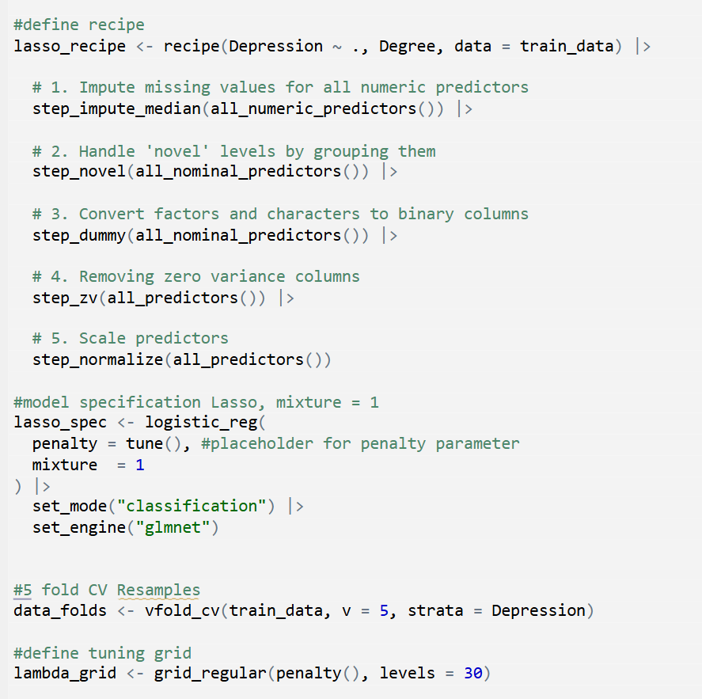
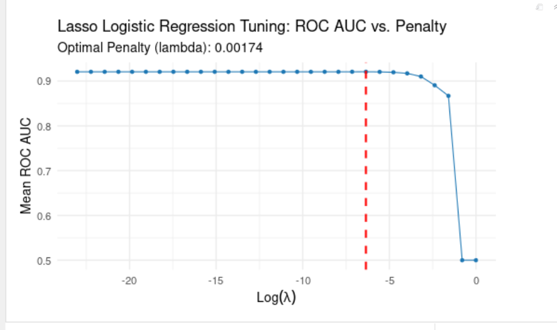

```{r setup, include=FALSE}
knitr::opts_chunk$set(echo = FALSE)
```


## How Well Can We Classify Student Depression?

* <span style="color: blue"> **Data Set** </span>

Student Depression Dataset

* <span style="color: blue">**Data**</span>

Almost 28,000 student records with various academic, financial, and lifestyle predictors


* <span style="color: blue">**Goal**</span>

Classify student depression risk with high accuracy and interpretability 

* <span style="color: blue">**Methods Used** </span>

Logistic Regression, K Nearest Neighbors, Lasso and Random Forest

## Specificities

**Categories:**

* Gender, Age, City, Academic Pressure, CGPA, Study Satisfaction, Sleep Duration, Dietary Habits, Academic Level, Have You Ever Had Suicidal Thoughts?, Financial Stress, Family History of Mental Illness, and **Depression**

* 13 Categories

* Removed ID, Profession, Work Pressure and Job Satisfaction


## Descriptive Graphs


## Slide 2: The Results - Tanner

Key Takeaways

- **Random Forests can make accurate predictions** for student depression  
- **Trying multiple mtry values** (features per split) improves performance,  
  though it increases computation time  
- **Variable importance is highly intuitive and useful** for interpretation  
    - Suicidal Thoughts  
    - Academic Pressure  
    - Age  
    - Study Hours  
- **Cross-validation accuracy exceeded 83.5%**


## K-nearest neighbours

**Why KNN**
  
K-nearest neighbors is a supervised classification method

* Binary outcome (depressed (1) vs not depressed (0))
* Continuous predictors 
* KNN is non-parametric 

## CV 

**One important choice in KNN is k**

* if k is too small the model is noisy
* if k is too big it is too smooth

So, we tried two standard values k = 5 vs k = 10
For the accuracy check we used 5 - fold cross-validation. 

```{r, echo=FALSE, out.width="40%", fig.align='center'}

```

k = 5 gives about 0.759 accuracy, k = 10 gives about 0.773.
Since k = 10 is slightly better, we chose k = 10 for our final KNN model.

## Confusion matrix

The CV accuracy doesn't report how many mistakes the model made. To see that we use confusion matrix

```{r, echo=FALSE, out.width="40%", fig.align='center'}

```

##

**On our test set we had 8,371 students**

* 2,413 of 3,509 non-depressed students were correctly classified as ‘no depression’
* 4,034 of 4,862 depressed students were correctly classified as ‘depression’
* 828 depressed students were missed (model said ‘no depression’).
* 1,096 non-depressed students were false alarms (model said ‘depression')

Overall, it gives us approximately 77% of accuracy

## KNN numerical + categorical

After that, we also let KNN use the categorical information:
* we added categorical variable
* turned these into dummy variables
* used 5 fold cross-validation

## CV

```{r, echo=FALSE, out.width="40%", fig.align='center'}

```

* k = 10 again performs better than k = 5
* The best cross-validated accuracy is now about 0.83, which is higher than the 0.77 we had with numeric predictors only

## Confusion matrix
To see what this means in terms of individual students, we again look at the confusion matrix for k = 10:

```{r, echo=FALSE, out.width="40%", fig.align='center'}

```

##

**Total students in this test set: 5,581**

* 1,699 of 2,304 non-depressed students were correctly predicted as 0
* 2,917 of 3,277 depressed students were correctly predicted as 1
* 360 depressed students were missed (predicted as 0 instead of 1)
* 605 non-depressed students were false alarms (predicted as 1 instead of 0)

Overall, KNN with numeric + categorical predictors reaches about 82–83% accuracy,
so including these categorical variables makes the model more accurate than using only numeric predictors


## Juliette Lasso

**Why Lasso:** 

Addressing overfitting and difficult interpretation, essentially logistic regression with an added L1 regularization penalty, due to high dimensionality

##
**The How**

* Transformed all categorical features into numeric dummy variables
* Standardized all numeric predictors so Lasso penalty will treat them equally
* Performed 5-fold CV to tune the penalty parameter, lambda, across 30 levels

```{r, echo=FALSE, out.width="40%", fig.align='center'}

```

##
**The Result**

* Chose the lambda value ($\lambda$) .00174 based on the **Receiver Operating Characteristic Area Under the Curve (ROC AUC)**, which yielded a peak CV performance of around 92%.

* Model set **28 coefficients to 0** and resulted in a sparser final model with 
**40 relevant features.**

* Some takeaways: For every standard deviation increase in Academic Pressure, the odds of a student experiencing depression increase by over $\mathbf{200\%}$ (a factor of $3.06$).

* For every one standard deviation increase in Study Satisfaction, the odds of experiencing depression decrease by about $27\%$. 


## Nice Graph!

```{r, echo=FALSE, out.width="80%", fig.align='center'}

```


## Slide 4: The Results - Leah

## Slide 5: Conclusion
