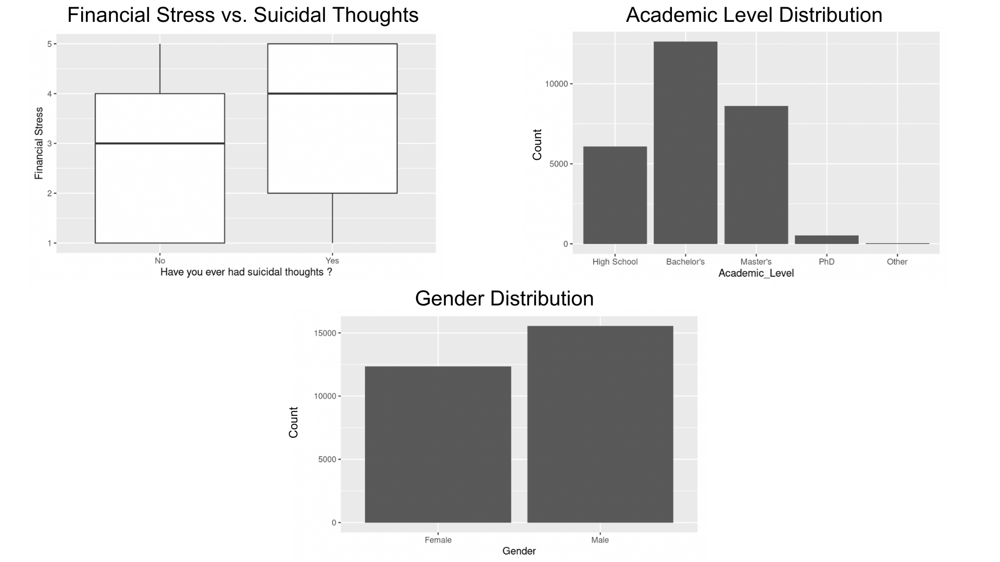
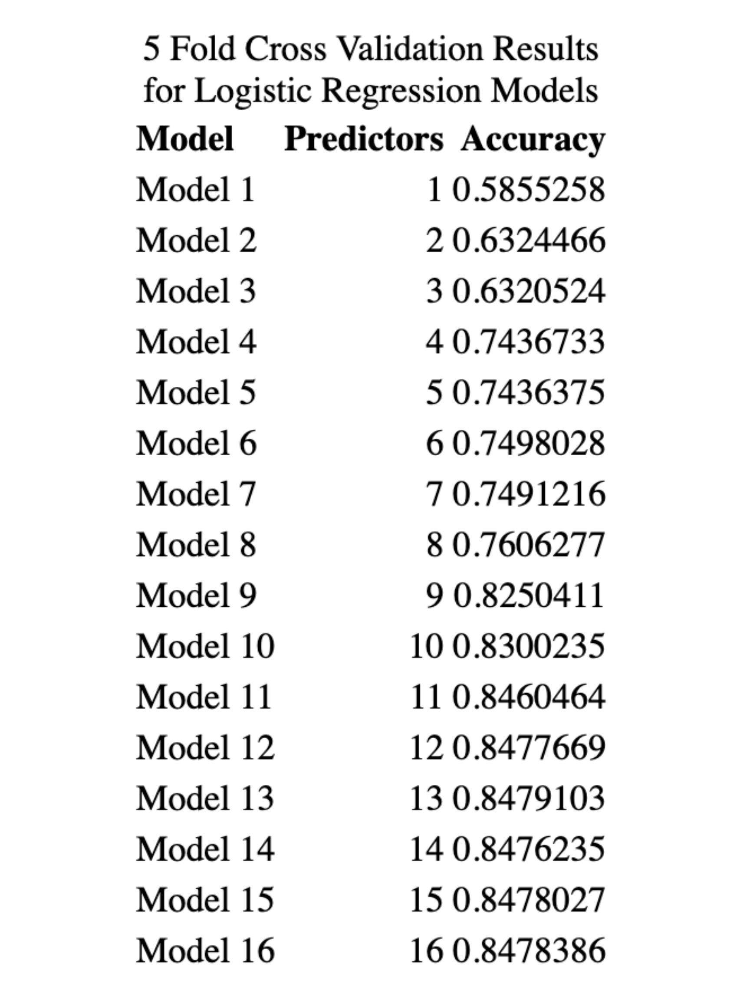
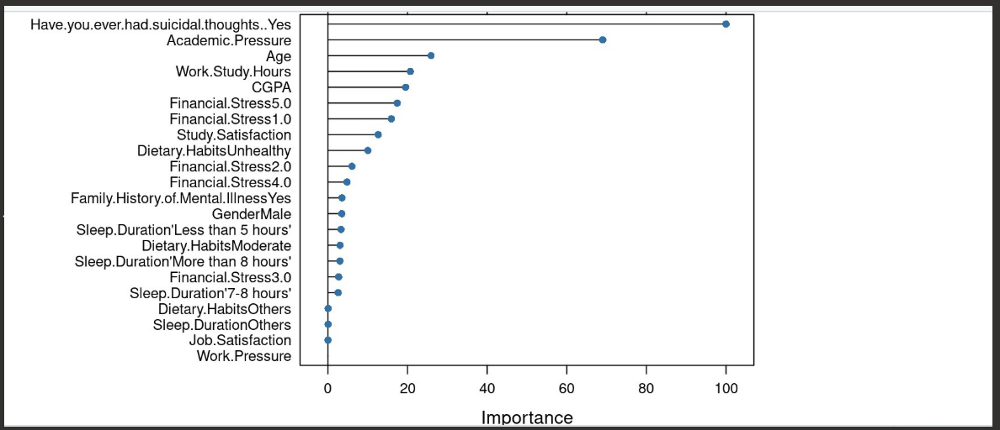
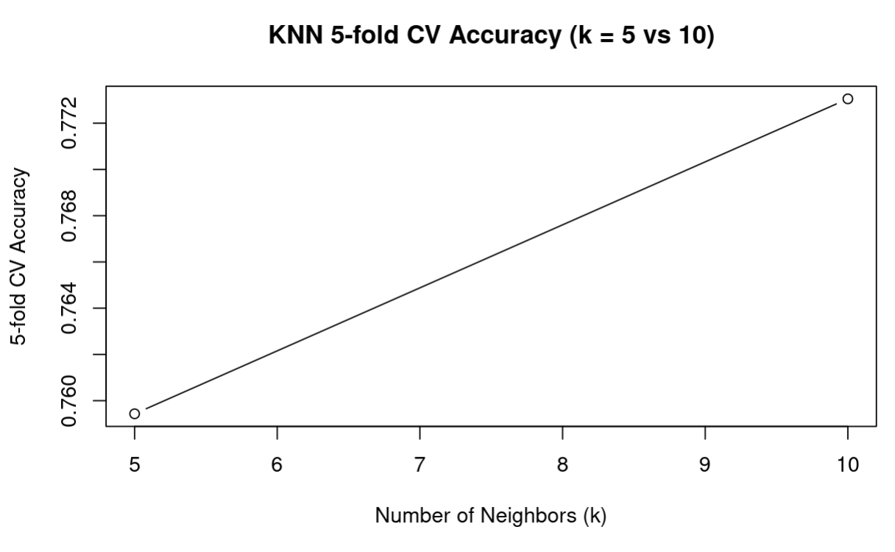
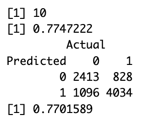
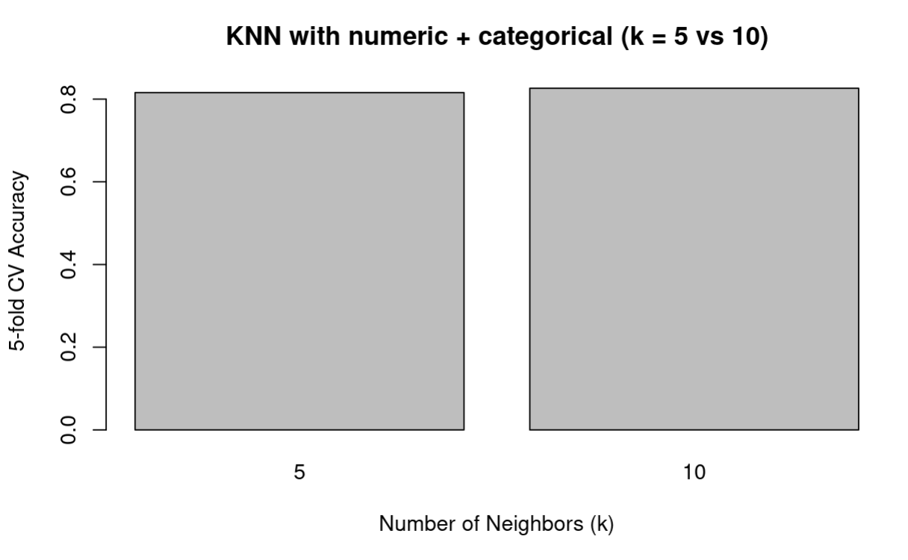
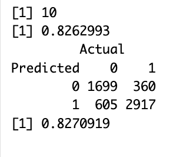
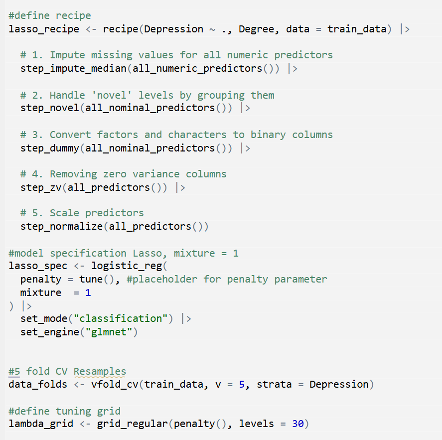
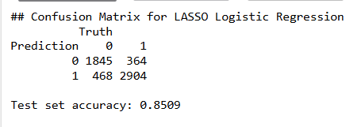

```{r setup, include=FALSE}
knitr::opts_chunk$set(echo = FALSE)
```


## How Well Can We Classify Student Depression?

* <span style="color: blue"> **Data Set** </span>

Student Depression Dataset

* <span style="color: blue">**Data**</span>

Almost 28,000 student records with various academic, financial, and lifestyle predictors


* <span style="color: blue">**Goal**</span>

Classify student depression risk with high accuracy and interpretability 

* <span style="color: blue">**Methods Used** </span>

Logistic Regression, K Nearest Neighbors, Lasso and Random Forest

## Specificities

**Categories:**

* Gender, Age, City, Academic Pressure, CGPA, Study Satisfaction, Sleep Duration, Dietary Habits, Academic Level, Have You Ever Had Suicidal Thoughts?, Financial Stress, Family History of Mental Illness, and **Depression**

* 13 Categories

* Removed ID, Profession, Work Pressure and Job Satisfaction

## Leah - Data Exploration

* <span style="color:blue">**Goal of plotting**</span>
  Prior to fitting any models, understand relationships present between various predictors.
  
* <span style="color:blue">**Process**</span>
  - Created scatterplots for numeric-numeric pairs
  - Created bar plots for categorical predictors
  - Created boxplots to visualize interactions between categorical and numeric predictors
  - Created histograms to visualize distributions of numeric predictors
  
* <span style="color:blue">**Key Takeaways of plots**</span>
  - Higher financial stress among students who reported "yes" to having suicidal thoughts
  - Most students were under the age of 35, identified as men, and were pursuing undergraduate degrees
  
## Example Plots
  
```{r, echo=FALSE, out.width="80%", fig.align="center"}

```


## Leah - Logistic Regression

* <span style="color:blue">**Approach**</span>
  - Created 16 logistic regression models, starting with a single predictor and slowly adding more
  
* <span style="color:blue">**Details**</span>
  - Converted all categorical predictors into factors
  - Created a list of formulas for the various models - 16 models total, 13 adding predictors individually and 3 with interaction terms based on intuition
  - Used a loop to fit each model with formulas
  
* <span style="color:blue">**Motivation for Approach**</span>
  - Comparing model complexity between various predictors and measure predictive accuracy compared to another types of models

  
## Leah - 5-Fold Cross Validation Results

* <span style="color:blue">**Details**</span>
  - Group landed on each trying 5-fold cross validation for each of the models to compare accurately
  - Using model, predicted depression status and compared to actual depression status
  - Calculated accuracy for each of the models
  - Averaged model performance across folds
  
* <span style="color:blue">**Top Performing Models**</span>
  1. **All 13 predictors, no interaction terms** - Accuracy: **84.791%**
  2. **All 13 predictors + Interaction of Family History of Mental Illness x Have you ever had suicidal thoughts?** - Accuracy: **84.784%**
  3. **All 13 predictors + Interaction of Sleep Duration x Work/Study Hours** - Accuracy: **84.780%**
  
##   
* <span style="color:blue">**Conclusion**</span>
  - Best performing model was one with no interactions, and although adding they came close in terms of accuracy, they did not improve it much.
  
```{r, echo=FALSE, out.width="30%", fig.align="center"}

```

Logistic Regression Test Set Accuracy: 0.8435484 


## The Results - Tanner

Key Takeaways

- **Random Forests can make accurate predictions** for student depression  
- **Trying multiple mtry values** (features per split) improves performance,  
  though it increases computation time  
- **Variable importance is highly intuitive and useful** for interpretation  
    - Suicidal Thoughts  
    - Academic Pressure  
    - Age  
    - Study Hours  
- 
- **Test set accuracy: 89.48%**
- This accuracy improved because of adjustments made after the presentation
## 

```{r, echo=FALSE, out.width="95%", fig.align='center'}

```

## K-nearest neighbors

**Why KNN**
  
K-nearest neighbors is a supervised classification method

* Binary outcome (depressed (1) vs not depressed (0))
* Continuous predictors 
* KNN is non-parametric 

## CV 

**One important choice in KNN is k**

* if k is too small the model is noisy
* if k is too big it is too smooth

So, we tried two standard values k = 5 vs k = 10
For the accuracy check we used 5 - fold cross-validation. 

```{r, echo=FALSE, out.width="40%", fig.align='center'}

```
##
k = 5 gives about 0.759 accuracy, k = 10 gives about 0.773.
Since k = 10 is slightly better, we chose k = 10 for our final KNN model.

## Confusion matrix

The CV accuracy doesn't report how many mistakes the model made. To see that we use confusion matrix

```{r, echo=FALSE, out.width="40%", fig.align='center'}

```

##

**On our test set we had 8,371 students**

* 2,413 of 3,509 non-depressed students were correctly classified as ‘no depression’
* 4,034 of 4,862 depressed students were correctly classified as ‘depression’
* 828 depressed students were missed (model said ‘no depression’).
* 1,096 non-depressed students were false alarms (model said ‘depression')

Overall, it gives us approximately 77% of accuracy

## KNN numerical + categorical

After that, we also let KNN use the categorical information

* we added categorical variable

* turned these into dummy variables

* used 5 fold cross-validation

## CV

```{r, echo=FALSE, out.width="40%", fig.align='center'}

```

* k = 10 again performs better than k = 5
* The best cross-validated accuracy is now about 0.83, which is higher than the 0.77 we had with numeric predictors only

## Confusion matrix
To see what this means in terms of individual students, we again look at the confusion matrix for k = 10:

```{r, echo=FALSE, out.width="40%", fig.align='center'}

```
Test set accuracy: 82.7%

## Interpretation

**Total students in this test set: 5,581**

* 1,699 of 2,304 non-depressed students were correctly predicted as 0
* 2,917 of 3,277 depressed students were correctly predicted as 1
* 360 depressed students were missed (predicted as 0 instead of 1)
* 605 non-depressed students were false alarms (predicted as 1 instead of 0)

Overall, KNN with numeric + categorical predictors reaches about 82–83% accuracy,
so including these categorical variables makes the model more accurate than using only numeric predictors


## LASSO-Regularized Logistic Regression

**Why Lasso:** 

* Addressing overfitting and difficult interpretation due to the large number of predictors (high dimensionality).

* Essentially, it is Logistic Regression with an added L1 regularization penalty.

$$\text{Minimize} \left( \text{Negative Log-Likelihood} + \lambda \sum_{j=1}^{p} |\beta_j| \right)$$

##
**How Lasso Was Prepared**

* Transformed all categorical features into numeric dummy variables.

* Standardized all numeric predictors so the Lasso penalty ($\lambda$) treats them equally.

* Tuned the penalty parameter ($\lambda$): Performed 5-fold CV across 30 levels of $\lambda$ to find the optimal sparsity/fit trade-off.

```{r, echo=FALSE, out.width="40%", fig.align='center'}

```

##
**Lasso Sparsity and Interpretability**

* Optimal $\lambda$ Value Chosen: The final $\lambda$ of $.00174$ was chosen to maximize cross-validated performance.

* Feature Selection: The model set 27 coefficients to zero (out of 67 total predictors) and resulted in a sparse final model with 40 relevant features.

* Key Interpretive Takeaways (from Non-Zero Coefficients):
* For every standard deviation increase in Academic Pressure, the odds of a student experiencing depression increase by over $\mathbf{200\%}$ (a factor of $3.03$).

* For every one standard deviation increase in Study Satisfaction, the odds of experiencing depression decrease by about $25.8\%$ (a factor of $0.74$).


## 
**Lasso Test Set Performance**

* Test Set Accuracy: 85.09% 
* Confusion Matrix 


```{r, echo=FALSE, out.width="80%", fig.align='center'}

```

##

**Total students in this test set: 5,581**

* 1,845 of 2,304 non-depressed students were correctly predicted as 0
* 2,904 of 3,277 depressed students were correctly predicted as 1
* 364 depressed students were missed (predicted as 0 instead of 1)
* 468 non-depressed students were false alarms (predicted as 1 instead of 0)


## Slide 5: Conclusion
* We compared Test Set Accuracy because it measures performance on completely unseen data, providing the most unbiased estimate of real-world model effectiveness.

* Test set accuracy

* Tanner RF: 83.35%

* Juliette Lasso: <span style="color: blue"> **85%**  </span>

* Munisa KNN: 82.7%

* Leah Logistic Regression (model 13): 84.35%

Best Test set accuracy: Lasso

## Takeaways
* The LASSO's <span style="color: blue"> **L1 regularization penalty was highly effective** </span>, leading it to outperform the simpler, unregularized Logistic Regression (85.00% vs. 84.35%) 
* Lasso also outperformed the complex, harder-to-interpret models (RF and KNN). 
* This demonstrates that  <span style="color: blue"> **sparsity and simplicity** </span>, along with a <span style="color: blue"> **linear structure** </span> , are the ideal fit for classifying student depression risk in this dataset.
* Academic Pressure is the Primary Driver: The strongest factor driving depression risk is Academic Pressure. (The LASSO model confirmed that for every one standard deviation increase in Academic Pressure, the odds of a student experiencing depression increase by over $200\%$ (a factor of $3.03$).)


